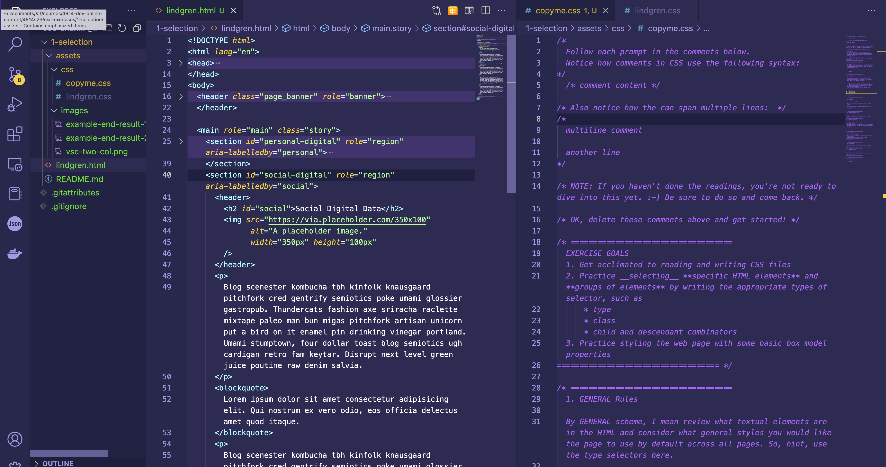
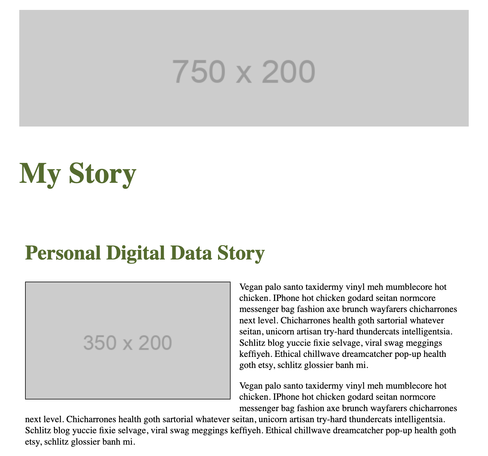
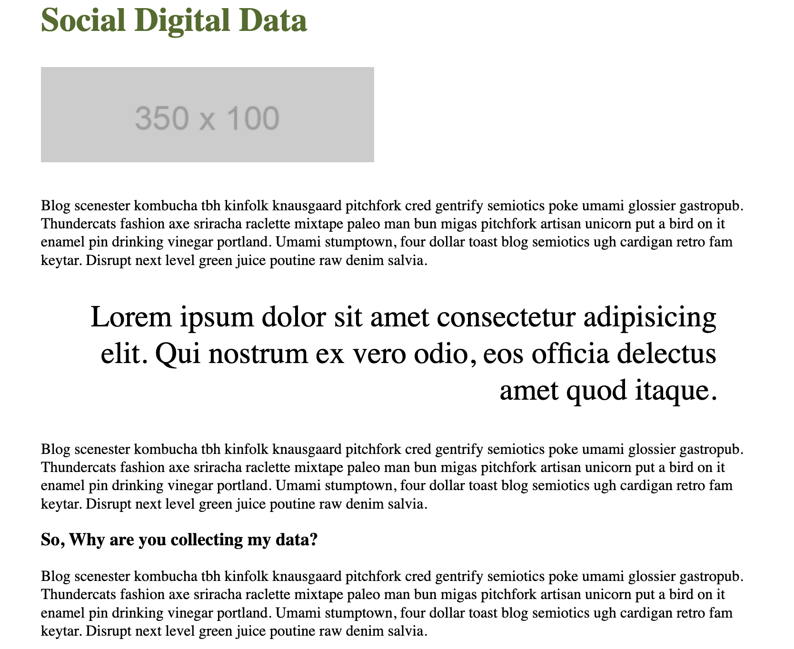

# CSS Selection & Basic Rules Practice

**IMPORTANT** For this particular assignment, please do not push your code iteratively as usual. Please wait until just before class. That way, everyone has an opportunity to complete the assignment on their own.

## Setup Your Exercise Workflow

1. First, ***read the readings &amp; watch the videos*** before attempting to complete this exercise.
2. Copy the `copyme.html` file.
    * **NOTE**: Make sure it is within the root of this `1-selection` folder.
3. Rename this copied `.html` file with your last name.
4. Copy the `copyme.css` file in the `assets/css` folder.
    * **NOTE**: Make sure this copy is within the `assets/css` folder.
5. Rename this copied `.css` file with your last name.
6. Open your `html` and `css` files in the vertical pane view, so you can read both files throughout the assignment.
    
7. Click into your `index.html` file and then click "Go Live" to open your page in the browser (Firefox please!).
8. In Firefox/Chrome, right-click on the page and select "Inspect Element" to open the inspection tool.
9. In the HTML document, use the `<link>` element inside the `<head>` to *link* your `.css` stylesheet to this `.html` file.
    - **WARNING**: If you don't link the html and css files together, none of your CSS will be applied to the HTML. :-D
10. Follow the prompts in the `.html` and `.css` documents to complete the assignment.
    - **NOTE**: There is only one prompt in the `.html` file regarding the `<link>` to the CSS file.

## "DO NOT DO" TIPS
1. Write a bunch of CSS before testing it in the browser.
    * **Why?** Before you move onto the next prompt and task, you need to practice using the inspection tool to see if your CSS has been applied and is to your liking.
    * **Consequences**: If you don't test your code, component-by-component, then you will create lots of problems and errors across *multiple* parts of your page
    * **Solution**: Work iteratively instead.

2. Never use your browser's inspection tool.
    * **Why?** How will you know if it is working, unless you inspect it and study it?
    * **Consequences**: Same as the above.
    * **Solution**: Practice, practice, practice selecting one component element at a time, adding a ruleset, and then testing it in your browser **before moving onto the next prompt**.

## EXAMPLE END RESULT

Your end result should look something like the below image. Of course, your idiosyncratic choices with text/font and spacing choices will make it slightly different.

