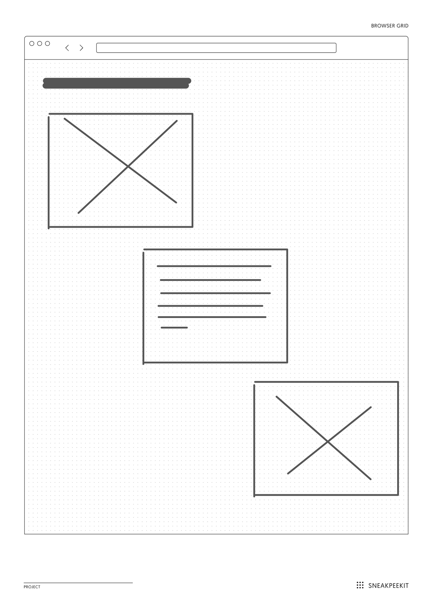
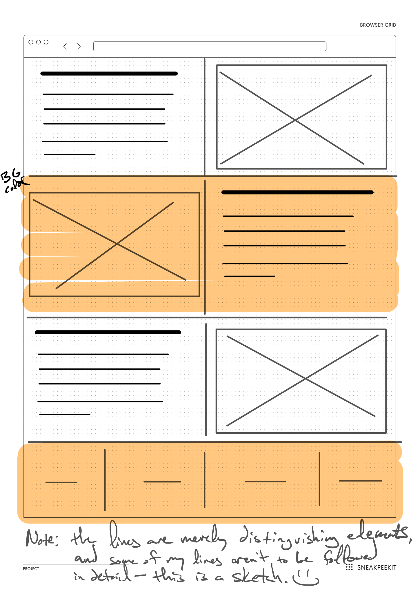

# Intro to Flexbox!

Okay, FIRST, right-click on the tab above and select "Open Preview." This will open the file as a rendered document, so you can see the wireframe images.

**Description**: Flexbox will help you design web content components that are flexible along 1-Dimension, either as rows or as columns.

## Goals

- Create **2 common layouts** with flexbox display behavior. (See the wireframe images below.)
- Implement a flexbox design with HTML that creates:
     1. parent **flex container** that contains
     2. `n` number of children **flex items**.
- Write CSS that tells those children **flex items** how to behave inside of the parent **flex container**. Pyt another way, you will apply certain flexbox *rules* to align the children **flex items** that are within the parent **flex container** container.

## Folder-File Setup

Follow this procedure to setup your coding folder:

1. Within this root folder, create a new folder with the name:
 `lastname`.
   - **NOTE** `lastname` is your last name. Mine would be: 
   `lindgren`.
2. Inside the root of *your personal coding folder*, create 
an `index.html`.
3. Again, inside the root of *your personal coding folder*, 
create an `assets` folder.
4. Inside `assets`, create a `.keep` file and a `css` folder.
5. Inside `css`, create a `style.css` to link to `index.html`.
6. Within the `index.html`, first use the type `!` and hit `return` to create a skeleton HTML page.
7. Link your stylesheet to your HTML document. *Make sure the path is correct!*
8. Inside the `body`, please create the following structure. Your solution for each design problem will be in their own `section`:
     ```
     body
     |_main
       |_section
       |_section
     ```
     
     Again, each section will contain 1 flex design.

9. **※\(^o^)/※** Start writing some code! **※\(^o^)/※**

### Example project folder structure

```
lindgren
  |_assets
  | |_.keep
  | |_css
  |   |_style.css
  |
  |_index.html

```

## 1. Stepping Stones

There are a couple solutions to create this design scheme. Just pause for a moment, though, and figure out how many children flex items are needed to be contained by a flex container. From there, it should be more clear about how you can line up these children items in step-wise fashion, as seen in the wireframe below.

Apply some classes to the appropriate HTML elements, so you can use them in your CSS.




## 2. Switching-It-Up

Like #1, there are possible multiple solutions, so do not get mired into thinking there's ONE-SOLUTION-TO-RULE-THEM-ALL. Do your best and think about how to create a flex container > flex item relationship in your HTML, so you can then tell those children how to create a flexible scheme like below.

Apply some classes to the appropriate HTML elements, so you can use them in your CSS.




## Other Considerations

- I recommend inspecting these sites with the **MOZILLA FIREFOX** browser's inspection tool. It has a more robust inspector than Chrome. However, the latest version of Chrome now has a flex and grid inspection tool.
- If you'd like to spice it up with your own flare, feel free to practice some basic typography and color schemes. 
- You can also use your own images, instead of placeholders. BUT, be sure to create your own images folder in your project, and be mindful of the file sizes, since others will fetch these files too.
- Practice documenting your code and writing your CSS from more general rules to more specific in the HTML source order.
- **NOTE**: I do not mind if you work together with anyone, but you should not write the same code together. Help each other instead.
- **DO NOT** push your code until class time.
