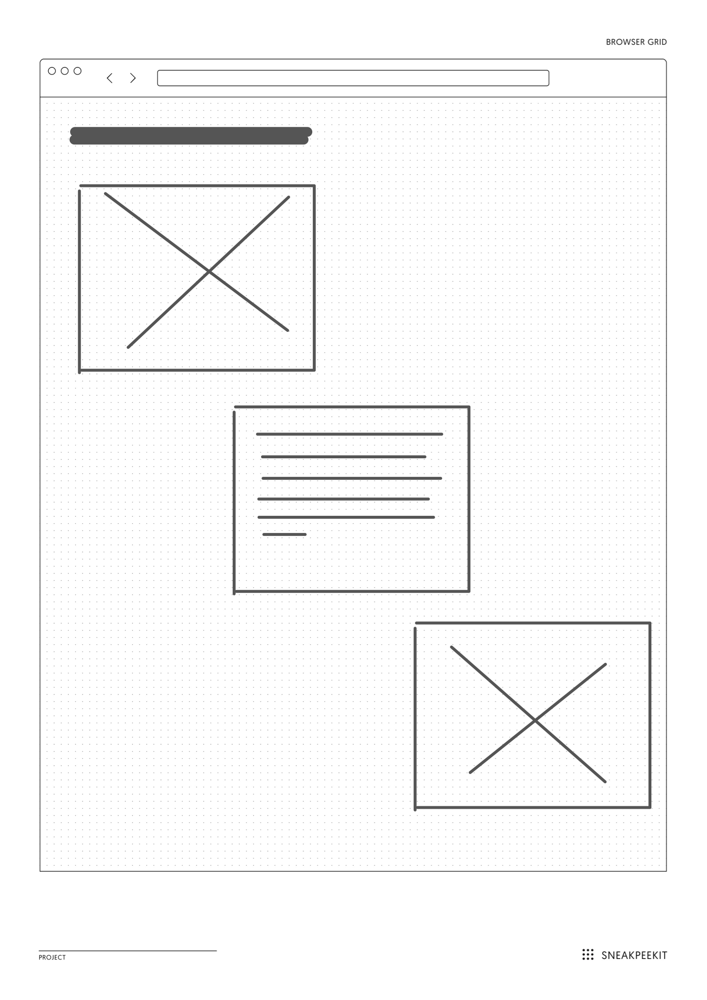
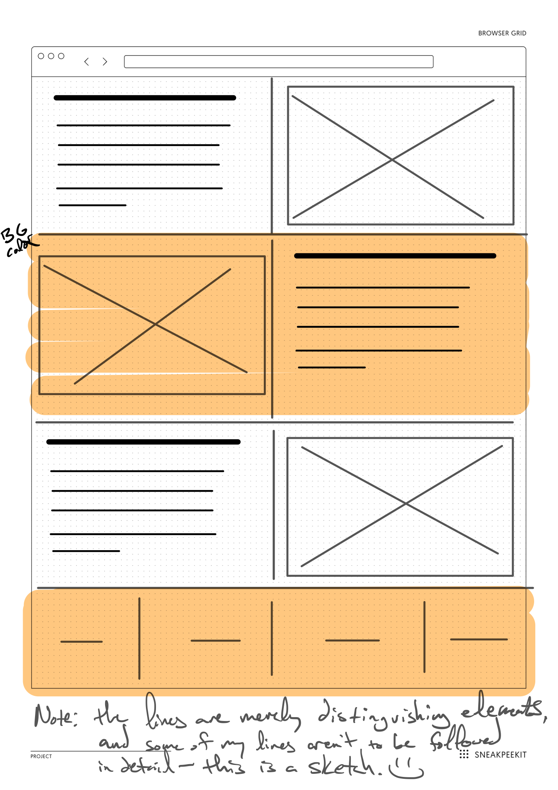

# Flexing Your 1-Dimensional Alignment Skills with Flexbox (`display: flex;`)

## Goals

- Flexing your flexbox alignment skills to create 3 basic layouts.
- Practice creating a **flex container** with **flex items** as its children.
- Align the flex items within your flexbox container with 
reusable classes

## Folder Setup

Follow this procedure to setup your coding folder:

1. Within this root folder, create a new folder with the name:
 `lastname-flex`.
   - **NOTE** `lastname` is your last name. Mine would be: 
   `lindgren-flex`.
2. Inside the root of *your personal coding folder*, create 
an `index.html`.
3. Again, inside the root of *your personal coding folder*, 
create an `assets` folder.
4. Inside `assets`, create a `.keep` file and a `css` folder.
5. Inside `css`, create a `style.css` to link to `index.html`.
6. Within the `index.html`, please create a `main` with a `section` for each of the 3 flexbox designs that you need to produce.
7. **※\(^o^)/※** Start writing some code! **※\(^o^)/※**

## 1. Stepping Stones

Line some children items up step-wise, as seen in the wireframe
 below.

There are variations on this design scheme, but try to write
 your HTML and CSS in a way that balances the amount of code necessary to write it, as well as code that is **reusable as possible classes** to reuse across a larger site.

## 2. Switching-It-Up

Spot the design pattern in the wireframe below, and 
recreate it with flexbox.

Like #1, there are variations on this design scheme,
 but try to write your HTML and CSS in a way that balances
  the amount of code necessary to write it, as well as code
   that is **reusable as possible classes** to reuse across
    a larger site.

## 3. Create Your Own Flexbox Design

Taking up the design principles from our reading, 
design your own alignment and draw your own wireframe. 
Then, add it to a new section after the prior 2 sections.

Save an image of your wireframe within your `assets` folder.

## Other Considerations

- Practice designing these sites with the **MOZILLA FIREFOX** 
browser's inspection tool. It has a more robust inspector
 than Chrome. However, the latest version of Chrome now has
  a flex and grid inspectioon tool.
- If you'd like to spice it up with your own flare, feel free
 to practice some basic typography and color schemes. 
- You can also use your own images, instead of placeholders.
 BUT, be sure to create your own images folder in your project,
  and be mindful of the file sizes, since others will fetch
   these files too.
- Practice documenting your code and writing your CSS from 
more general rules to more specific in the HTML source order.
- **NOTE**: I do not mind if you work together with anyone,
 but you should not write the same code together. 
 Help each other instead.
- **DO NOT** push your code until class time.
- Be sure to submit the assignment link in Canvas.